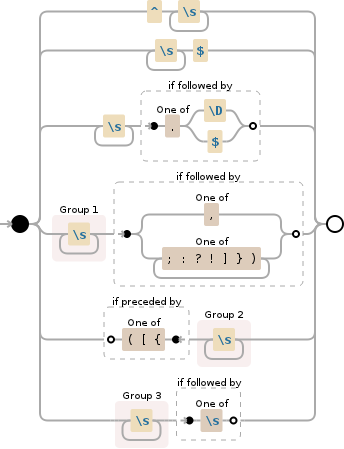

```{r, echo = FALSE, message = FALSE}
library(regextools); library(qdapRegex)
```

The management of a regular expression library can be an overwhelming because of the lack of readability and structural frameworks for such maintenance tasks.  The **regextools** package is part of a suite of tools that provide structure for the development and management of regular expression libraries.  **regextools** treats regular expression libraries as an R package.  This enables **regextools** to simply furnish tools that extend the [**devtools**](http://r-pkgs.had.co.nz/intro.html), **roxygen2**, & **testthat** packages directed toward regular expression documentation, testing, and storage.  The [**regexr**](https://github.com/trinker/regexr) package can provide the complementary front end to the process.  **regexr** provides tools to make regular expressions more human readable through functions that enable a regular expression to be broken into commented, readable subexpression chunks.  Together, these packages work together to create a coding environment and philosophy which encourages transparency, structure, modularity, and testing. 

## Functions

**regextools** is lightweight, extending the **devtools**, **roxygen2**, & **testthat** frameworks to regular expression management.  **regextools** contains only a few functions that can be roughly broken into tools to produce *regular expression files and documentation* (prefixed with `library_`) and tools to extend **testthat**'s *unit testing* (prefixed with `test_`) of your library's regular expressions.  The former encourages cross platform sharing of your library, while the later ensures that improvements to a regular expression do not break expected outcomes. 


```{r, echo=FALSE, results='asis', warning=FALSE}
library(regextools)
thefuns <- readLines("functions_table/functions.R")
cat(paste(thefuns, collapse="\n"))
```

## Regular Expression File Storage and Documentation

The **regextools** framework is rigid by design.  It encourages structured behaviors that make regular expression management more rigorous and the expressions themselves more transparent and understandable.  The good news is that it adopts Hadley Wickham's existing, popular framework for package development.  This means that users need not become familiar with an additional set of expectations.

### library_template

The `library_template` function is similar to `devtools::create` but much less flexible.  It creates a standard package template but, by default, expects the user to employ **testthat**'s unit testing combined with the use of [GitHub](https://github.com/), [Travis-CI](https://travis-ci.org), and the [**covr**](https://github.com/jimhester/covr) package for transparent unit testing.


\****Note** that if the user supplies a `name` (first and last), `email`, and `github.user` (these can be set in the user's .Rprofile)* significant portions of the *DESCRIPTION* and *README.md* files will be automatically filled in with correct information.

The ***R*** directory contains a minimal *sample.R* **roxygen2** style template:

```{r, eval=FALSE}
#' Words [SAMPLE] 
#' 
#' Find words.
#' 
#' @section Regex: TRUE
#' @export
#' @examples
#' regmatches("I like candy.", gregexpr(MY_REGEX, "I like candy.", perl = TRUE))
#' 
#' gsub(MY_REGEX, "", "I like candy")
#' 
#' strsplit("I like candy", MY_REGEX)   
myRegex <- "\\w+"
```

Note the additional of the `@section Regex: TRUE` to indicate that the documented objet is a regular expression.

The directory ***tests*** contains **testthat**'s unit testing framework and an example *test-sample.R* file for quick reference (we will discuss unit testing later).

### Documentation: `library_vignette`

Standard **R** help documentation is verbose.  Many package maintainers produce vignettes like this one, in order to give the reader a more refined, less verbose instruction of package use. **regextools** takes the approach that documentation for a regular expression should include:

1. Explicit Description
2. Visual Representation
3. Demonstration 

Explicitness of the description is essential to the maintainability and transparency of the regular expression library.  In addition, **regextools** utilizes visual diagrams (links to or iframe embedding) provided by [Debuggex's](https://www.debuggex.com) to give a nonlinear view of the expression.  In the following figure we can visualize the `rm_white` regular expression from the **qdapRegex** package's ***regex_usa*** library that is used to remove extraneous white spaces:

```{r, comment=NA}
qdapRegex::grab("@rm_white")
```



Lastly, the documentation should include examples that demonstrate how the regular expression fulfills the description.  The examples should closely resemble unit tests for the regular expression for the sake of rigor and maintainability of code.  The use of `regmatches`/`gregexpr`, `gsub`, and `strsplit` can demonstrate how an expression extracts, subs, and splits text (see sample vignette below)..

The `library_vignette` function can be used to auto generate a less verbose vignette to explicitly describe and demonstrate the regular expression.  The following code will generate an .Rmd and .html (see below) document.

```{r, eval=FALSE}
library_vignette(system.file("sample", package = "regextools"), "vignette",
    is.vignette = FALSE, include.html=TRUE, document = FALSE, install = FALSE)
```

<iframe src="http://trinker.github.io/regextools/vignettes/sample.html" height="400", width="100%"></iframe>

### Storage

The default storage of the **regextools** frame work is a sharable GitHub package.  This is excellent for many applications.  However, the user may desire to produce an **R** `list` for use in another package.  The `library_list` utilizes the regular expression library package to generate an **R** `list` that is stored in a .rda file (see `?base::save`).  This is the lightest weight version of the regular expression library, containing no documentation.  This .rda file can be loaded with the base **R** `load` function or placed in another package's ***Data*** directory.  Here is an example utilizing **regextools**'s built in, minimal regular expression library package, *sample*.


```{r, eval=FALSE}
library_list(system.file("sample", package = "regextools"),
     document = FALSE, install = FALSE)

sample             ## sample is a base R function
load("sample.rda")
sample             ## sample is now overwritten with the sample regex list
rm(sample)         ## remove the list (restore default sample)
```

`library_minimal` provides a lightweight regular expression library that contains a minimal .rda list (compliments of `library_list`) and an .html/.md file (compliments of `library_vignette`).

## Unit Testing

**regextools** takes the position that *unit testing* is an essential part of regular expression library management.  *Test driven development* is a recommended approach to developing and recurring regular expression development.  In this approach the user first defines what the expression should do.  A series of tests are developed to ensure that the created expression achieves and continues to maintain this standard throughout the development process.  The means that changes won’t break existing functionality.

Hadley Wickham's [**testthat**](http://journal.r-project.org/archive/2011-1/RJournal_2011-1_Wickham.pdf) package provides an excellent platform for testing functions.  This framework is easily extended to regular expressions.  **regextools** complements the structure **testthat** already has in place through four functions:

1. `test_extract`
2. `test_remove`
3. `test_split`
4. `test_valid`

The first three functions logically test if a regular expression is extracting, removing and splitting as expected.  The fourth function tests the **R**'s **Perl** based validity of a regular expression.

The first three functions utilize the following setup:

- **test_extract** - `regmatches(input, gregexpr(regex, input, perl = TRUE))`    
- **test_remove** - `gsub(regex, "", input, perl = TRUE)`    
- **test_split** - `strsplit(input, regex, perl = TRUE)`     

The functions takes a text string `input` to test upon, a `regex`, and an expected `output`.  These functions utilize `all.equal` to test the obtained output in comparison to the expected output.  The user can wrap these calls with **testthat**'s `expect_true` in the unit test .R files.

```{r}
MY_REGEX <- "\\w+"  

test_extract(MY_REGEX, "I like candy.", list(c("I", "like", "candy")))
test_remove(MY_REGEX, " I like candy ", "    ")
test_split(MY_REGEX, " I like candy ", list(c(" ", " ", " ", " ")))
test_valid(MY_REGEX)
```

In the following test an extra period was intentionally placed in the `output` to demonstrate a regular expression not acting as expected.

```{r}
test_extract(MY_REGEX, "I like candy.", list(c("I", "like", "candy.")))
```

## Conclusion

**regextools**, coupled with existing package development packages, provides a framework and philosophy which encourages transparency, structure, modularity, and testing in the development and management of regular expression libraries.  **regextools** treats regular expression libraries as **R** packages to harness the power of:

1. [GitHub](https://github.com)
2. [RStudio](http://www.rstudio.com/)
3. [Travis-CI](https://travis-ci.org)
4. [Coveralls](https://coveralls.io/)
5. [devtools*](http://r-pkgs.had.co.nz/intro.html)
6. [roxygen2*](http://cran.r-project.org/web/packages/roxygen2/index.html)
7. [testthat*](https://github.com/hadley/testthat)
8. [covr*](https://github.com/jimhester/covr)
9. [regexr*](https://github.com/trinker/regexr)

\* ***Note** items marked with \* are **R** packages*

Users will need to become familiar with these platforms in order to utilize **regextools**.  This framework is designed to provide the structure that standardizes, gives transparency and understanding, and improves the quality of regular expression libraries.


